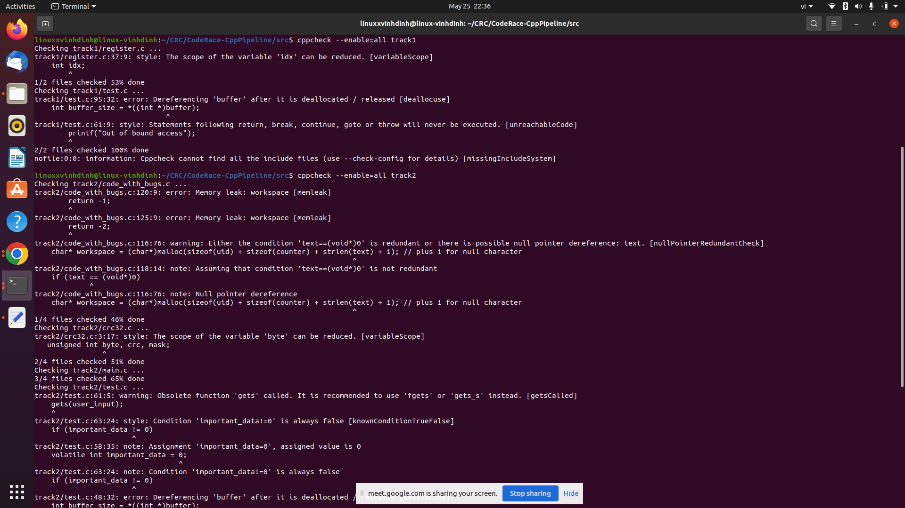

# Memeow team progress
## Stage 1: syntax error fix src/track1/register.c
* edit "case default:" to "default:": line 55.
* edit "LIN_Rx3.regBufferRx[idx]" to "LIN_Rx3.bufferRx[idx]": line 72.
* edit "LIN_Rx3.regBufferRx[idx]" to "LIN_Rx3.bufferRx[idx]": line 82.
* edit "LIN_Rx3.regBufferRx[idx]" to "LIN_Rx3.bufferRx[idx]": line 106.
* edit "while (i>0)" to "while (idx>0);": line 108.
* edit "LIN_Rx3.regBufferTx[idx]" to "LIN_Rx3.bufferTx[idx]": line 119
* edit "while (idx>0)" to "while (idx>0);": line 121
* edit "for (idx = 0; i < (LIN_Rx3.length - 1); i++)" to "for (idx = 0; idx < (LIN_Rx3.length - 1); idx++)": line 130.
* edit "LIN_Rx3.regBufferRx[idx]" to "LIN_Rx3.bufferRx[idx]": line 132.
* edit "LIN_Rx3.regBufferRx[idx]" to "LIN_Rx3.bufferRx[idx]": line 135.
## Stage 2: find security scan tools
* First, we try some tools as SonarQube, KlocWork, Kiuwan and Snyk.
* The problems are: SonarQube is not free, KlocWork does not have trial for students, Kiuwan need a brief call to discuss about project and Snyk has a problem that we cant figure it out what the problem is.

KlocWork email.

Kiuwan email.

Snyk problem.

* Then we found another tool - cppcheck. Luckily it works perfectly fine in our local machine.

Cppcheck

* Our pipeline test.

Cppcheck on Azure pipeline output.

## Stage 3: extend pipeline file
* Add step install cppcheck
* Add step run cppcheck

## Stage 4: fix vulnerabilities 
track1/register.c

* Eemove "int idx": line 37
* add "int" to the loop: line 46
* Edit "idx" to "dataLen": line 51

track1/test.c

* Move "free(buffer - HEADER_SIZE)" to line below 100
* Swap line 61 and line 62

track2/code_with_bugs.c

* Move line 116 to line 127 (below 2 conditional statements)

track2/crc32.c

* Move "unsigned int byte" and "unsigned int mask" to the line below line 7

track2/test.c

* Move line 45 to the line below line 53
* Swap line 13 and line 14
* Use strcmp(c, "FUZZING") == 0 instead of c == "FUZZING": line 95
* Edit variable type of "n" from "int" to "long long": line 93
* 
